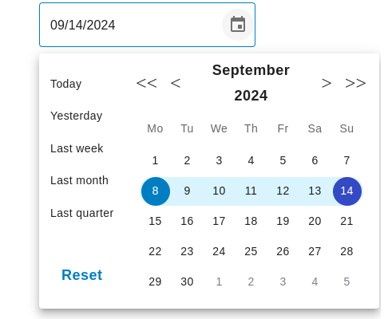

---

# Custom MUI Date Range Picker

A customizable date range picker component built on top of MUI Date Pickers.

See Demo in [stackblitz](https://stackblitz.com/edit/vitejs-vite-zrmeum?file=src%2Findex.css)

<iframe src="https://stackblitz.com/edit/vitejs-vite-zrmeum?embed=1&file=src%2Findex.css"></iframe>



## Installation

To install the package, use npm:

```bash
npm install react-quick-date-range-picker
```

## Usage

Import the `DateRangePicker` component and use it in your application:

```javascript
import DateRangePicker from 'react-quick-date-range-picker';

// ...

<DateRangePicker
  value={null} // Initial date range (optional)
  onChange={(value) => console.log(value)} // Callback for date range changes
  // Other props (see below)
/>
```

### Props

| Prop       | Type                         | Description                                   | Default Value |
|------------|------------------------------|-----------------------------------------------|---------------|
| `value`    | `DateRange`                 | Initial date range.                          | `null`        |
| `onChange` | `(value: DateRange) => void` | Callback function called when the date range changes. | `null`        |
| `...restProps` | ''                    | Other props passed to the underlying MUI DatePicker component. | -             |

`react-quick-date-range-picker` supports all MUI date picker props : [https://mui.com/x/api/date-pickers/date-picker/](https://mui.com/x/api/date-pickers/date-picker/)

## Customization

You can customize the date range picker by passing props to the `DateRangePicker` component or by modifying the component's internal implementation. For example, you can customize the appearance, behavior, and functionality of the date picker using MUI's styling system and customization options.

### Example

Here is an example of how to use and customize the date picker:

```javascript
import DateRangePicker from 'react-quick-date-range-picker';
import { useState } from 'react';

const MyDateRangePicker = () => {
  const [selectedDates, setSelectedDates] = useState<DateRange | null>(null);

  const handleDateRangeChange = (value: DateRange | null) => {
    setSelectedDates(value);
  };

  return (
    <DateRangePicker
      value={selectedDates}
      onChange={handleDateRangeChange}
      // Customize the date picker appearance
      sx={{
        '& .MuiDatePicker-root': {
          // Your custom styles
        },
      }}
    />
  );
};
```

## Contributing

Contributions are welcome! Please feel free to submit pull requests or issues.

## License

This project is licensed under the MIT License.

---
